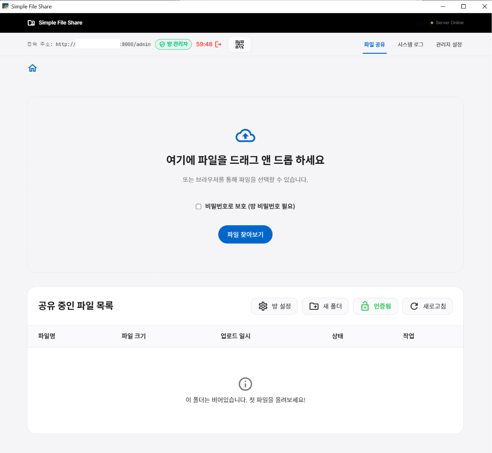

# Simple File Share

[한국어 README](README.md)

---

## 🚀 Getting Started

### 1. Download from Git

[Git](https://git-scm.com/downloads) must be installed.

```bash
git clone https://github.com/syschat0/SimpleFileShare.git
cd SimpleFileShare
```

Without Git, download the repository as a ZIP from the GitHub page (**Code → Download ZIP**), extract it, and open the project folder.

### 2. Prerequisites

- Windows 11 (tested)
- Python 3.12 or higher (install from [python.org](https://www.python.org/downloads/); check **Add to PATH**)

### 3. Run in Development Mode — `run.bat`

Use this when developing and testing changes to the source code.

1. Open the project root folder you downloaded above.
2. Double-click `run.bat` or run it from Command Prompt:

   ```cmd
   run.bat
   ```

**How it works**
- If a `venv` virtual environment exists, it is activated automatically and `python run.py` is started.
- If `venv` is missing, an error is shown. Run `build.bat` first, or follow [Manual Setup](#manual-setup-development).

> On first run, if `config.json` is missing, it is created with port `8000` and the default admin password `admin`.

### 4. Set Up Environment and Build — `build.bat`

Creates the virtual environment, installs dependencies, and builds a standalone `.exe` in one step.

1. From the project root, double-click `build.bat` or run:

   ```cmd
   build.bat
   ```

**What it does**
1. Verifies Python is installed
2. Creates `venv` if it does not exist
3. Installs or updates dependencies from `requirements.txt`
4. Cleans previous build artifacts (`build`, `dist`, `.spec`)
5. Builds a single executable with PyInstaller

**Build output**
- `dist\SimpleFileShare.exe` — standalone executable that runs without Python

After the build completes, double-click `dist\SimpleFileShare.exe` to run or distribute the app.

### BAT Script Summary

| File | Purpose |
|------|---------|
| `run.bat` | Run in dev mode (activate `venv` → `run.py`) |
| `build.bat` | Create `venv`, install dependencies, build `SimpleFileShare.exe` |

---

## 🛠️ Manual Setup (Development)

To set up without BAT scripts, complete [Download from Git](#1-download-from-git) first, then follow these steps.

1. **Create a virtual environment**

   ```bash
   python -m venv venv
   ```

2. **Activate the virtual environment (Windows)**

   ```cmd
   venv\Scripts\activate
   ```

3. **Install dependencies**

   ```bash
   pip install -r requirements.txt
   ```

4. **Run the app**

   ```bash
   python run.py
   ```

---

## About

**Simple File Share** is a standalone file sharing service for local networks. Upload, manage, and share files with an Apple-inspired, photography-first design. It runs as a desktop app with an embedded server, and any device on the same network can access it through a web browser.

**Screenshot**



> **Tested on**: Development, execution, and builds have been verified on **Windows 11**.

---

## ✨ Features

- **Apple-Inspired UI/UX**: Interface built on Apple design principles—edge-to-edge tiles, SF Pro typography, and a single Action Blue accent color.
- **Drag & Drop Uploads**: Upload files by dragging them into the browser or desktop app window.
- **Standalone Desktop App**: Distributed as a Pywebview-built `.exe`. End users do not need Python installed.
- **Local Network Sharing**: Automatically hosts a web server reachable from any device on the same network.
- **Real-Time System Logs**: Monitor server status, connections, and internal logs from the app UI.
- **Admin Dashboard**: Configure port number, maximum upload size, admin password, and more.

---

## 🛠️ Technology Stack

- **Backend**: Python 3.12, FastAPI, SQLAlchemy (SQLite), Uvicorn
- **Frontend**: HTML5, Vanilla CSS (Apple design system), Vanilla JavaScript
- **Desktop GUI**: Pywebview
- **Packaging**: PyInstaller

---

## 🎨 Design Philosophy

The frontend is hand-written without CSS frameworks and follows an Apple-inspired design language (see `DESIGN.md`).

**Key design traits**
- **Photography-first**: Minimal UI chrome so content stands out
- **Typography**: `SF Pro Display` and `SF Pro Text` with negative letter-spacing at display sizes
- **Color**: Alternating Pure White / Parchment / Near-Black tiles; `Action Blue` (#0066cc) for all interactions
- **Elevation**: A soft drop shadow only on elements resting on surfaces—no decorative gradients or unnecessary borders

---

## 📝 License

This project is licensed under the MIT License.
